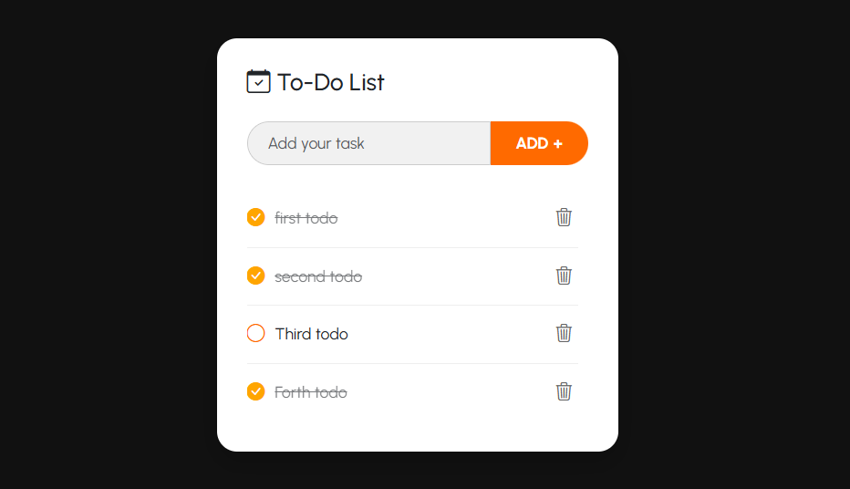

# Todo Application

A simple and elegant web-based Todo application built with Spring Boot and Thymeleaf.

## 🖼️ Preview

<p align="center">
  
</p>

## 📋 Features

- ✅ Add new todo items
- ✅ Mark todos as completed
- ✅ Delete todo items
- ✅ Responsive web interface
- ✅ Persistent data storage with MySQL
- ✅ Clean and modern UI with Bootstrap

## 🛠️ Technology Stack

- **Backend**: Spring Boot 3.5.3
- **Frontend**: Thymeleaf, HTML, CSS, Bootstrap 5.3.7
- **Database**: MySQL
- **Build Tool**: Maven
- **Java Version**: 21
- **Additional Libraries**:
  - Spring Data JPA
  - Lombok
  - Spring Boot DevTools

## 📁 Project Structure

```
todoapp/
├── src/
│   ├── main/
│   │   ├── java/
│   │   │   └── com/riduan/todoapp/
│   │   │       ├── TodoappApplication.java
│   │   │       ├── controller/
│   │   │       │   └── TodoController.java
│   │   │       ├── entity/
│   │   │       │   └── TodoEntity.java
│   │   │       └── repository/
│   │   │           └── TodoRepository.java
│   │   └── resources/
│   │       ├── application.properties
│   │       ├── static/css/
│   │       │   └── style.css
│   │       └── templates/
│   │           └── index.html
│   └── test/
├── pom.xml
└── README.md
```

## 🚀 Getting Started

### Prerequisites

- Java 21 or higher
- Maven 3.6+
- MySQL 8.0+
- IDE (IntelliJ IDEA, Eclipse, or VS Code)

### Database Setup

1. Install and start MySQL server
2. Create a database named `todoappdb`:
   ```sql
   CREATE DATABASE todoappdb;
   ```

### Installation & Running

1. **Clone the repository**
   ```bash
   git clone <repository-url>
   cd todoapp
   ```

2. **Configure database connection**
   
   Update `src/main/resources/application.properties` with your MySQL credentials:
   ```properties
   spring.datasource.url=jdbc:mysql://localhost:3306/todoappdb
   spring.datasource.username=your_username
   spring.datasource.password=your_password
   ```

3. **Build and run the application**
   ```bash
   # Using Maven wrapper (recommended)
   ./mvnw spring-boot:run
   
   # Or using Maven directly
   mvn spring-boot:run
   ```

4. **Access the application**
   
   Open your web browser and navigate to: `http://localhost:8080`

## 📖 API Endpoints

| Method | Endpoint | Description |
|--------|----------|-------------|
| GET | `/` | Display home page with todos |
| POST | `/add` | Add a new todo item |
| GET | `/update/{id}` | Mark todo as completed |
| GET | `/delete/{id}` | Delete a todo item |

## 🎨 User Interface

The application features a clean, modern interface with:
- Responsive design that works on desktop and mobile
- Bootstrap icons for visual appeal
- Color-coded completed/pending states
- Smooth user interactions

## 🗄️ Database Schema

The application uses a single entity `TodoEntity` with the following structure:

```sql
CREATE TABLE tbl_todos (
    id BIGINT AUTO_INCREMENT PRIMARY KEY,
    title VARCHAR(255) NOT NULL UNIQUE,
    completed BOOLEAN DEFAULT FALSE
);
```

## 🔧 Configuration

### Application Properties

Key configuration options in `application.properties`:

```properties
# Database Configuration
spring.datasource.url=jdbc:mysql://localhost:3306/todoappdb
spring.datasource.username=root
spring.datasource.password=your_password

# JPA/Hibernate Configuration
spring.jpa.hibernate.ddl-auto=update
spring.jpa.show-sql=true
spring.jpa.properties.hibernate.dialect=org.hibernate.dialect.MySQLDialect
```

## 🚦 Development

### Running in Development Mode

The application includes Spring Boot DevTools for hot reloading during development:

```bash
./mvnw spring-boot:run
```

### Building for Production

```bash
# Create JAR file
./mvnw clean package

# Run the JAR
java -jar target/todoapp-0.0.1-SNAPSHOT.jar
```
